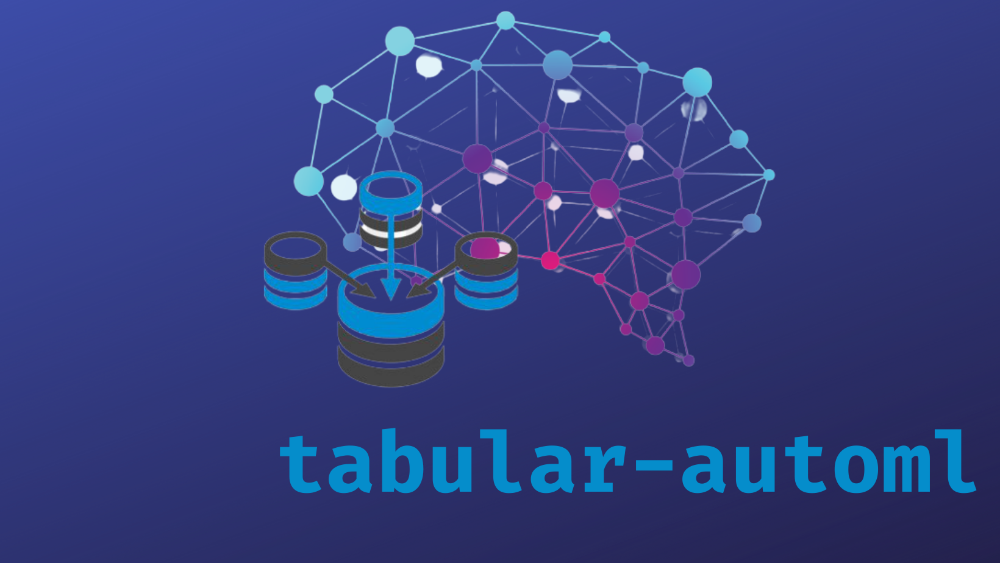

<div align="center"></div>

<div align="center"><h1>Tabular-AutoML</h1></div>
<div align="center"><h2>AutoML Package for tabular datasets</h2></div>

<div align = "center">
    <h3>Tabular dataset tuning is now hassle free!</h3>
    <h3>Run one liner command and get best tuning and processed dataset in a go.</h3>
</div>

<div align = "center">
   
   
</div>

---

<div align = "center">
  Used Python Libraries :
</div>
<div align = "center">
  
  
  
  
</div>

---

<div align = "center"><h1>Installation & Usage</h1></div>

---

1. Create a Virtual Environment : [Tutorial](https://docs.python.org/3/library/venv.html)
2. Clone the repository.
3. Open the directory with *cmd*.
4. Copy this command in terminal to install dependencies.
```shell
pip install -r requirements.txt
```
5. Installing the requirements.txt may generate some error due to outdated MS Visual C++ Build. You can fix this problem using [this](https://www.youtube.com/watch?v=rcI1_e38BWs).
6. First check the parser variable that has to be passed with all customizations.
```python
>>> python -m tab_automl.main --help
usage: main.py [-h] -d  -t  -tf  [-p] [-f] [-spd] [-sfd] [-sm]

automl hyper parameters

optional arguments:
  -h, --help            show this help message and exit
  -d , --data-source    File path
  -t , --problem-type   Problem Type , currently supporting *regression* or *classification*
  -tf , --target-feature
                        Target feature inside the data
  -p , --pre-proc       If data processing is required
  -f , --fet-eng        If feature engineering is required
  -spd , --save-proc-data
                        Save the processed data
  -sfd , --save-fet-data
                        Save the feature engineered data
  -sm , --save-model    Save the best trained model

```
7. Now run the command with your custom data, problem type and target feature
```python
>>> # For Regression Problem
>>> python -m tab_automl.main -d "your custom data scource\custom_data.csv" -t "regression" -tf "your_custom_target_feature" -spd "true" -sfd "true" -sm "true"

>>> # For Classification Problem
>>> python -m tab_automl.main -d "your custom data scource\custom_data.csv" -t "classification" -tf "your_custom_target_feature" -spd "true" -sfd "true" -sm "true"
```

---

<div align = "center"><h1>Contributing Guidelines</h1></div>

---

1. Comment on the issue on which you want to work.
2. If you get assigned, fork the repository.
3. Create a new branch which should be named on your GitHub user_id , e.g. ```sagnik1511```.
4. Update the changes on that branch.
5. Create a PR (Pull request) to the **`JWOC`** branch of the parent repository.
6. The PR title should be named like this 
```[Issue {Issue Number}] Heading of the issue```.
7. Describe the changes you have done with proper reasons.

---

**This branch will hold all updates of JWOC.**

<div align = "left"><h2>Contributors</h2></div>

---
1. <h4>Sagnik Roy : <a href="https://github.com/sagnik1511">sagnik1511</a></h4>


<div align = "center"><h1>If you like the project, do ⭐</h1></div>

<div align = "center"><h1>Also follow me on <a href="https://github.com/sagnik1511">GitHub</a> , <a href="https://kaggle.com/sagnik1511">Kaggle</a> , <a href="https://in.linkedin.com/in/sagnik1511">LinkedIn</a></h1></div>

<div align = "center"><h1>Thank You for Visiting :)</h1></div>
